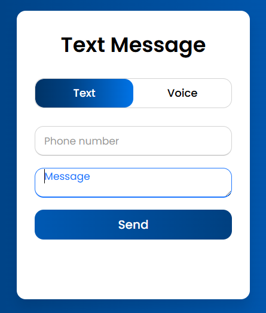
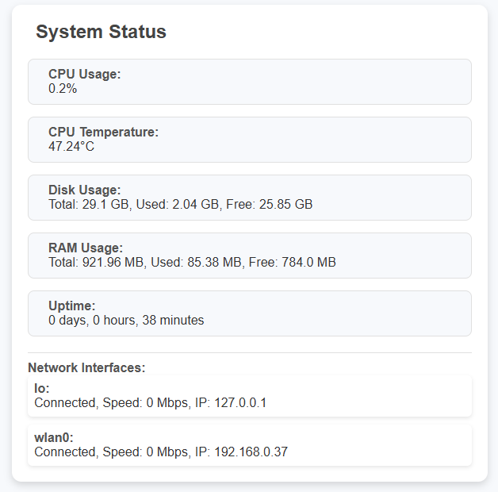
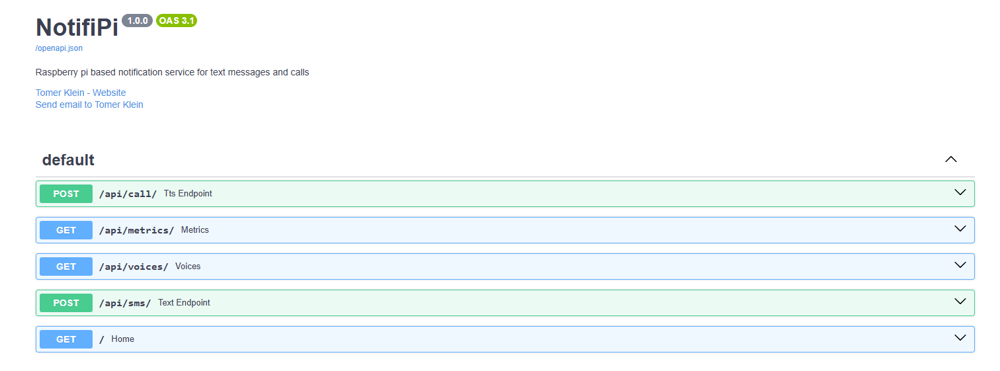
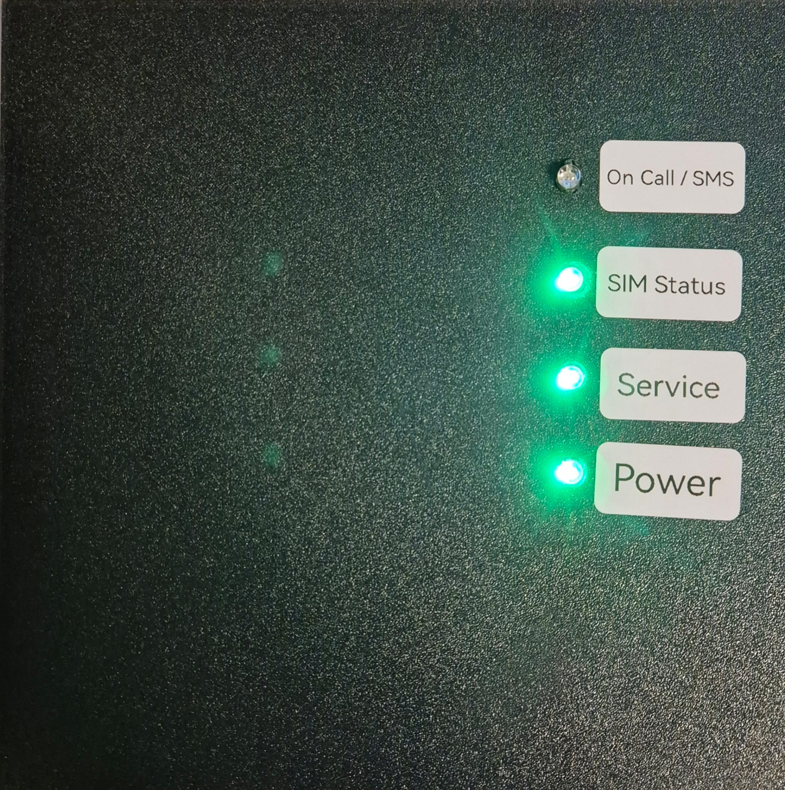
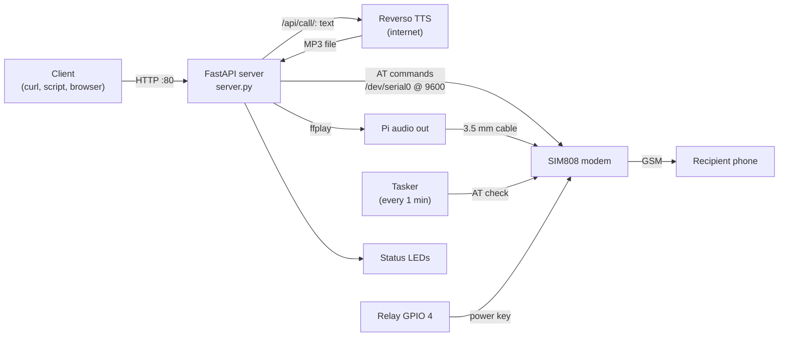

# NotifiPi

A FastAPI-powered web server for seamless SMS and voice call notifications.

NotifiPi runs on a Raspberry Pi with a SIM808 GSM module. It exposes a small HTTP API and web UI that let you:

* Send SMS messages via a simple API endpoint (Unicode text is supported, including Hebrew).
* Deliver voice messages through automated phone calls. The message is converted to speech and played into the call.

Perfect for IoT projects, alert systems, or any application requiring instant notifications, with no third-party SMS gateway: messages go out through your own SIM card.


## Table of Contents

- [Features](#features)
- [Screenshots](#screenshots)
- [Hardware](#hardware)
- [How It Works](#how-it-works)
- [Requirements](#requirements)
- [Installation](#installation)
- [Configuration](#configuration)
- [API Reference](#api-reference)
- [Web UI](#web-ui)
- [Status LEDs](#status-leds)
- [Logging](#logging)
- [Troubleshooting](#troubleshooting)
- [Security Notes](#security-notes)
- [Known Issues](#known-issues)
- [Project Layout](#project-layout)
- [Contributing](#contributing)
- [License](#license)

## Features

- **SMS sending** through a SIM808 modem using AT commands in UCS2 mode, so non-ASCII text works.
- **Voice calls with text-to-speech**: the text is converted to an MP3 with [Reverso TTS](https://pypi.org/project/pyttsreverso/) (`pyttsreverso`), the modem dials the number, and the audio is played into the call.
- **Many TTS voices** (Arabic, English, French, German, Hebrew, Spanish, Russian, Japanese and more), listed by `GET /api/voices/`.
- **Web UI** with Text and Voice tabs for sending messages from a browser.
- **System status page** showing CPU usage and temperature, disk, RAM, uptime and network interfaces.
- **Interactive API docs** (Swagger UI) generated by FastAPI.
- **Modem power control**: a relay on GPIO 4 pulses the modem's power key when it does not answer, and a background task re-checks the modem every minute.
- **Four RGB status LEDs** for power, service, SIM and call/SMS activity.

## Screenshots

### Send an SMS



### Make a voice call


### System status



### API docs (Swagger UI)



## Hardware

### Bill of materials

What the code and the build photos show:

| Part | Notes |
|------|-------|
| Raspberry Pi | The build uses a Raspberry Pi 3 Model B. Any Pi with a UART on `/dev/serial0`, GPIO and a 3.5 mm audio output should work. <!-- TODO: verify other models --> |
| SIM808 GSM/GPRS module | The code refers to the SIM808 in its log messages. The build uses a SIM808 breakout board with a GSM antenna. |
| SIM card | With SMS and voice enabled. No SIM PIN handling in the code (see [Security Notes](#security-notes)). |
| 5 V relay module | Drives the SIM808 power key from GPIO 4. The build uses a Songle SRD-05VDC-SL-C relay on a perfboard. |
| 4 × RGB LEDs + resistors | Power, Service, SIM Status and On Call / SMS indicators. The code drives a pin HIGH to light a color, so common-cathode LEDs are assumed. <!-- TODO: verify LED type and resistor values --> |
| 3.5 mm audio cable + audio interface | Carries the Pi's audio output into the SIM808 microphone input, so the TTS audio is heard in the call. In the build, the signal passes through a small interface on the perfboard (resistors and capacitors) between the Pi's headphone jack and the SIM808 audio input. <!-- TODO: verify audio interface component values and circuit --> |
| Power supply and enclosure | The SIM808 needs its own supply capable of GSM current peaks. <!-- TODO: verify supply rating --> |

The finished enclosure, with the LED labels:



### Wiring

All GPIO numbers are **BCM** numbers (the code calls `GPIO.setmode(GPIO.BCM)`).

| Function | GPIO (BCM) |
|----------|-----------|
| Modem UART | `/dev/serial0` (GPIO 14 TXD / GPIO 15 RXD), crossed to the SIM808 RXD/TXD, common GND |
| Relay (SIM808 power key) | GPIO 4 |
| Power LED (R / G / B) | 17 / 27 / 22 |
| Service LED (R / G / B) | 5 / 6 / 13 |
| SIM Status LED (R / G / B) | 19 / 26 / 20 |
| On Call / SMS LED (R / G / B) | 21 / 16 / 12 |

## How It Works



1. **Startup** (`app.py`): the app sends `AT` to the modem until it answers `OK`. While it doesn't, it pulses the relay on GPIO 4 for 2 seconds to power the modem on. It then starts two workers: the web server and the task scheduler.
2. **SMS** (`sim.py`): the modem is set to text mode (`AT+CMGF=1`), the UCS2 character set (`AT+CSCS="UCS2"`) and SMS parameters `AT+CSMP=17,167,0,8`. The phone number and message are hex-encoded as UCS2, `AT+CMGS="<number>"` is sent, and after the `>` prompt the message is written and terminated with Ctrl+Z.
3. **Voice call**: the message is converted to an MP3 with Reverso TTS (pitch 100, bitrate 128). The modem dials with `ATD<number>;`, polls `AT+CLCC` up to 10 times for an active call, plays the MP3 with `ffplay -nodisp -autoexit`, waits 2 seconds and hangs up with `ATH` (up to 5 tries), then `AT+CHUP` as a last resort. The audio is **pre-generated TTS** played through the Pi's audio output. There is no DTMF input.
4. **Health check** (`tasker.py`): there is no message queue. A `schedule` job runs `ensure_sim_ready` every minute: it sends `AT` and, if there is no `OK`, pulses the relay to power the modem on. `ensure_sim_ready` has a 2-attempt cap, but `power_on_sim()` itself loops until the modem answers `OK`, so while the modem stays silent the cap is never reached and the check blocks indefinitely. SMS and call requests call the same function first, so they can hang the same way.
5. **Request handling**: SMS and call jobs run in a thread pool, and the HTTP request waits until the SMS is sent or the call has ended.

AT commands used: `AT`, `AT+CSQ` (signal quality helper, not called by the API), `AT+CMGF=1`, `AT+CSCS="UCS2"`, `AT+CSMP=17,167,0,8`, `AT+CMGS`, `ATD…;`, `AT+CLCC`, `ATH`, `AT+CHUP`.

## Requirements

- Raspberry Pi OS with Python 3 <!-- TODO: verify minimum Python version -->
- The serial port enabled for the modem: in `raspi-config`, under **Interface Options → Serial Port**, disable the login shell over serial and enable the serial hardware, so `/dev/serial0` is available.
- `ffmpeg` (provides `ffplay`) for playing the call audio.
- Internet access on the Pi for text-to-speech (Reverso TTS is an online service).
- `vcgencmd` (included in Raspberry Pi OS) for the core temperature on the status page. It is optional: the value is `null` without it.
- Root privileges, or another way to bind to port 80 and access GPIO.

## Installation

There is no Docker image, packaged release or systemd unit. Run it from source on the Pi:

```bash
sudo apt update
sudo apt install -y git python3-pip ffmpeg

git clone https://github.com/t0mer/NotifiPi.git
cd NotifiPi
sudo pip3 install -r requirements.txt
# Not listed in requirements.txt but imported by the code:
sudo pip3 install pyserial RPi.GPIO

cd app                # templates are loaded from ./templates/
sudo python3 app.py
```

On newer Raspberry Pi OS releases, `pip` refuses system-wide installs. Use a virtual environment instead, and run it with root rights so it can bind to port 80. <!-- TODO: verify recommended install on current Raspberry Pi OS -->

Once running, open `http://<pi-ip>/` for the UI and `http://<pi-ip>/docs` for the API docs.

### Python dependencies

From `requirements.txt`: `fastapi[all]`, `uvicorn`, `pyttsreverso`, `psutil`, `schedule`, `loguru`, `aiofiles` and `requests`. Minimum versions are set for `fastapi`, `anyio`, `starlette`, `urllib3` and `h11` to avoid known vulnerabilities; nothing is pinned to an exact version. The code also imports `pyserial` and `RPi.GPIO`, which are not listed.

## Configuration

NotifiPi has **no config file, environment variables or CLI flags**. All settings are hard-coded; change them in the source files:

| Setting | Default | Where |
|---------|---------|-------|
| Listen host | `0.0.0.0` | `server.py`, `Server.run()` |
| Listen port | `80` | `server.py`, `Server.run()` |
| Serial port | `/dev/serial0` | `sim.py`, `Sim.__init__` |
| Baud rate | `9600` | `sim.py` |
| Serial read timeout | `1` s | `sim.py` |
| Relay (modem power key) pin | GPIO 4 (BCM) | `sim.py` |
| Relay pulse length | 2 s | `sim.py`, `power_on_sim()` |
| Modem health check interval | every 1 minute | `tasker.py` |
| `ensure_sim_ready` attempts | 2 (not effective: `power_on_sim()` loops until the modem answers, see [Known Issues](#known-issues)) | `sim.py` |
| Answer detection polls | 10 × `AT+CLCC` | `sim.py`, `call_and_play()` |
| Hangup attempts | 5 × `ATH`, then `AT+CHUP` | `sim.py`, `attempt_hangup()` |
| Default TTS voice | `Sharon-US-English` | `server.py` / `utils.py` |
| TTS pitch / bitrate | `100` / `128` | `utils.py`, `tts()` |
| CORS allowed origins | `*` | `server.py` |
| LED pins | see [Wiring](#wiring) | `led.py` |

## API Reference

The base URL is `http://<pi-ip>`. There is **no authentication**. FastAPI's default docs are available at:

- Swagger UI: `/docs`
- ReDoc: `/redoc`
- OpenAPI schema: `/openapi.json`

| Method | Path | Purpose |
|--------|------|---------|
| `POST` | `/api/sms/` | Send an SMS |
| `POST` | `/api/call/` | Call a number and play a TTS message |
| `GET` | `/api/voices/` | List supported TTS voices |
| `GET` | `/api/metrics/` | Raspberry Pi system metrics |
| `GET` | `/` | Web UI (HTML) |
| `GET` | `/status` | System status page (HTML) |

Errors raised in a handler return HTTP `500` with `{"detail": "<error message>"}`. Invalid request bodies (missing or wrongly typed fields) are rejected by pydantic with HTTP `422`.

### `POST /api/sms/`

| Field | Type | Required | Description |
|-------|------|----------|-------------|
| `phone_number` | string | yes | Recipient number, e.g. in international format |
| `message` | string | yes | Message text (Unicode supported) |

```bash
curl -X POST http://<pi-ip>/api/sms/ \
  -H "Content-Type: application/json" \
  -d '{"phone_number": "<recipient-number>", "message": "Door sensor triggered"}'
```

Response: `{"message": ""}`

### `POST /api/call/`

| Field | Type | Required | Default | Description |
|-------|------|----------|---------|-------------|
| `phone_number` | string | yes | | Number to dial |
| `message` | string | yes | | Text to speak |
| `voice_name` | string | no | `Sharon-US-English` | One of the values from `/api/voices/` |

```bash
curl -X POST http://<pi-ip>/api/call/ \
  -H "Content-Type: application/json" \
  -d '{"phone_number": "<recipient-number>", "message": "Water leak detected in the basement", "voice_name": "Sharon-US-English"}'
```

Response: `{"message": ""}`. The request returns after the call has been hung up.

### `GET /api/voices/`

Returns a JSON array of voice names, for example:

```json
["Leila-Arabic", "Lucy-British", "he-IL-Asaf-Hebrew", "Sharon-US-English", "Rosa-US-Spanish"]
```

### `GET /api/metrics/`

```json
{
  "network": {"wlan0": {"connected": true, "speed_mbps": 0, "ip_address": "192.168.0.10"}},
  "cpu": {"usage": 0.2, "temp": 47.24},
  "disk": {"total": "29.1 GB", "used": "2.04 GB", "free": "25.85 GB"},
  "ram": {"total": "921.96 MB", "used": "85.38 MB", "free": "784.0 MB"},
  "core_temp": 47.2,
  "uptime": "0 days, 0 hours, 38 minutes"
}
```

`cpu.temp` is read from `/sys/class/thermal/thermal_zone0/temp`, and `core_temp` from `vcgencmd measure_temp`. Either one is `null` when unavailable. Only interfaces that are up and have an IPv4 address are listed.

## Web UI

- **`/`**: a card with **Text** and **Voice** tabs.
  - **Text**: phone number and message, then **Send**. It calls `POST /api/sms/`.
  - **Voice**: phone number, message and a voice drop-down (loaded from `/api/voices/`), then **Call**. It calls `POST /api/call/`.
  - Results are shown in a SweetAlert2 dialog.
- **`/status`**: CPU usage and temperature, disk, RAM, uptime and network interfaces, from `/api/metrics/`. The data is loaded once when the page opens; refresh the page to update it.

`/` loads jQuery, SweetAlert2 and Google Fonts from public CDNs; `/status` loads jQuery and tries to load Font Awesome. The browser needs internet access for the pages to render correctly.

## Status LEDs

| LED | Color | Meaning |
|-----|-------|---------|
| Power | Not driven by the service | Every `LED()` constructor sets all LED pins LOW, and `power_on()` (green) is only called by the self-test, so this code never keeps the Power LED lit. A lit Power LED, as in the enclosure photo, comes from wiring outside this code or from the self-test. <!-- TODO: verify how the Power LED is wired --> |
| Service | Blue | Web server starting |
| Service | Green | FastAPI is up and ready |
| Service | Red | Service stopped (shutdown or Ctrl+C) |
| SIM Status | Green | Modem answered `AT` with `OK` |
| SIM Status | Red | Modem not responding |
| SIM Status | Off | Service stopped |
| On Call / SMS | Blue | An SMS is being sent or a call is in progress |
| On Call / SMS | Off | Idle |

To test the LEDs, run this from `app/`:

```bash
sudo python3 -c "import RPi.GPIO as G; G.setmode(G.BCM); from led import LED; LED().test()"
```

It steps through the states, 2 seconds each, then turns all LEDs off. `python3 led.py` on its own fails with a `RuntimeError`, because it never calls `GPIO.setmode` (see [Known Issues](#known-issues)).

## Logging

Logging uses [loguru](https://github.com/Delgan/loguru) with its default handler, which writes to stderr. No log file is configured. Logs include modem readiness, AT command responses, dialing and hangup progress, and TTS file names (debug level).

## Troubleshooting

| Symptom | Likely cause |
|---------|--------------|
| App stays at startup and the SIM Status LED is red | The modem doesn't answer `AT` on `/dev/serial0`. Check that the serial port is enabled (login shell disabled), the TX/RX wiring and baud rate (9600), the modem power supply and the relay on GPIO 4. |
| `Permission denied` on port 80 or GPIO | Run as root, or change the port in `server.py`. |
| `TemplateNotFound: index.html` | The app must be started from the `app/` directory. |
| Call connects but the recipient hears silence | The Pi's audio output isn't wired to the SIM808 mic input, or audio plays on the wrong output (HDMI instead of the headphone jack). |
| `POST /api/call/` returns `500` and the call may stay open | `ffplay` is missing (`apt install ffmpeg`). The error is raised before the hangup step. |
| `Error creating audio file` | Reverso TTS isn't reachable (no internet) or the voice name is invalid. |
| Log shows `Error: No prompt received, check SIM808 setup.` | The modem didn't return the `>` prompt for `AT+CMGS`. Check signal, SIM credit and SIM state. The API still returns `200` in this case. |
| Log shows `Failed to end the call with AT+CHUP as well` | The modem didn't hang up; power-cycle it. |

## Security Notes

- **The API has no authentication.** Anyone who can reach the Pi can send SMS messages and place calls on your SIM, which costs money and can be abused (spam, premium-rate numbers). Keep it on a trusted LAN, don't forward the port to the internet, and put a reverse proxy with authentication or a firewall in front of it if other hosts need access.
- **CORS is open** (`allow_origins=["*"]`), so any web page opened on your network can call the API from the browser.
- **Text-to-speech is sent to a third-party service** (Reverso). Don't put sensitive content in voice messages.
- **SIM PIN**: the code doesn't unlock the SIM (`AT+CPIN` is never sent). Use a SIM with the PIN lock disabled, or unlock it by other means. Disabling the PIN means anyone with physical access to the SIM can use it.
- The service runs as root to bind port 80 and access GPIO. Limit who can log in to the Pi.

## Known Issues

Found while reviewing the code (not fixed):

- **Answer detection is bypassed**: `call_and_play()` sets `connected=True` after the `AT+CLCC` loop, so the audio always plays and the no-answer branch never runs.
- **Failures can return success**: when `send_sms()` doesn't get the `>` prompt, or `call_and_play()` fails to dial, the function returns `False` but the API still responds `200 {"message": ""}`.
- **TTS files are not cleaned up**: each call writes a `<uuid>.mp3` to the working directory and never deletes it. The `audio/` directory created by `app.py` is not used.
- **No serial port locking**: `/dev/serial0` is opened by 5 separate `Sim()` instances: in `app.py`, `server.py`, `utils.py`, and twice in `tasker.py` (the top-level `Tasker` and a second one created by `Server`). Concurrent requests and the 1-minute health check can interleave AT commands.
- **Missing requirements**: `pyserial` and `RPi.GPIO` are imported but not listed in `requirements.txt`, and no dependency is pinned to an exact version (only minimum versions for a few).
- **Modem power-on can block forever**: `power_on_sim()` loops on `is_sim_available()` with no limit (`sim.py` lines 56-57). The 2-attempt cap in `ensure_sim_ready` is never reached, so while the modem doesn't answer, the health check and any SMS or call request hang indefinitely.
- **`python3 led.py` fails** with `RuntimeError`: the `__main__` block never calls `GPIO.setmode`. Use the command in [Status LEDs](#status-leds).
- Some log lines, such as `logger.info("Dialing number:", response)`, pass the modem response as a format argument, so it is not printed.
- `status.html` loads the Font Awesome stylesheet with a `<script>` tag, so the icons don't render.
- The `/status` route handler has the same function name (`home`) as `/`.

## Project Layout

```
app/
├── app.py        # entry point: waits for the modem, starts web server + tasker
├── server.py     # FastAPI app, routes, LED hooks, uvicorn on 0.0.0.0:80
├── sim.py        # SIM808 AT-command driver: SMS, call, hangup, relay power-on
├── tasker.py     # schedule job: modem health check every minute
├── led.py        # RGB status LEDs (BCM pins)
├── utils.py      # Reverso TTS, voice list, Raspberry Pi metrics
└── templates/
    ├── index.html   # Text / Voice UI
    └── status.html  # system status page
images/           # README photos and screenshots
requirements.txt
```

## Contributing

Issues and pull requests are welcome at [github.com/t0mer/NotifiPi](https://github.com/t0mer/NotifiPi). Please describe your hardware (Pi model, modem board) when reporting modem or audio problems.

## License

Licensed under the [Apache License 2.0](LICENSE).
